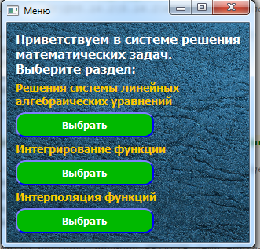
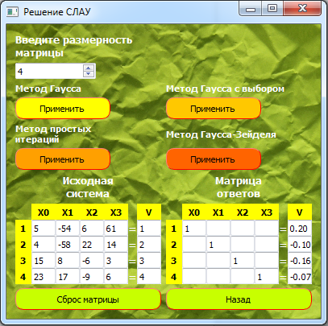
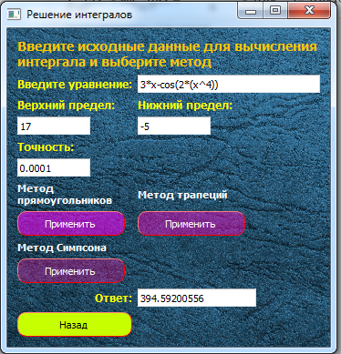
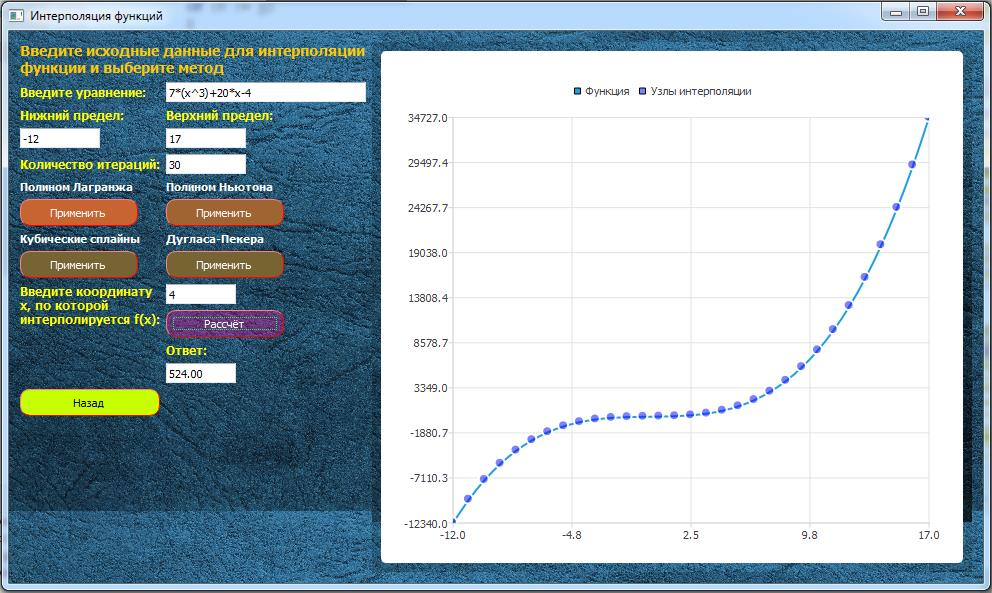
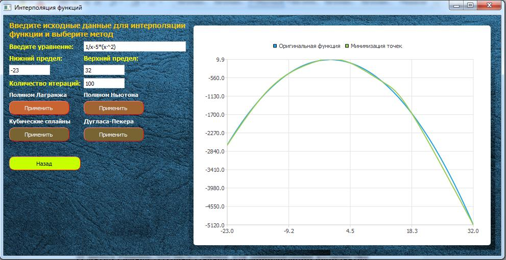

# math_algorithms_helper
**Application for solving some mathematical problems**

Application is a system for solving mathematical problems by describing some mathematical algorithms in code and providing the user with tools to work with them.
In particular, the problems to be solved will be:
- Solving a system of linear algebraic equations (SLAEs)
- Integrations
- Approximation (approximation and interpolation) of functions
Each of the problems will be solved in one or more ways.

Start page:

Solving SLAEs:
1.	Gauss method
2.	Gauss method with selection of the principal element
3. method of simple iterations
4.	Gauss-Seidel method

Example:

Integration:
1.	Method of rectangles
2.	Trapezoid method
3. Simpson's method

Example:

Approximation:
1. Lagrange polynomial interpolation
2. interpolation with Newton polynomial
3. interpolation by cubic splines
4.	Minimization by Ramer-Douglas-Pecker method

Example for interpolation:

Example for minimisation:

